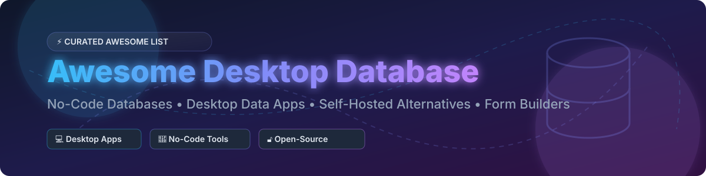

# 🗃️ Awesome Desktop Database

  
  
  
  
  

> **⚡ A Curated List of Commercial Tools, Desktop Data Apps, No-Code Databases & Open-Source GitHub Projects**
> 
> *Comprehensive guide to Microsoft Access alternatives, Airtable alternatives, self-hosted database tools, form builders, and visual relational database creation software.*

---

## 📖 Table of Contents
- [📊 Market Overview & Fragmented Sector Analysis](#-market-overview--fragmented-sector-analysis)
- [💼 Commercial SaaS & Desktop Tools](#-commercial-saas--desktop-tools)
- [🔓 Open-Source GitHub Projects](#-open-source-github-projects)
- [🤝 How to Contribute](#-how-to-contribute)
- [💖 Support & Sponsorship](#-support--sponsorship)
- [📈 Star History](#-star-history)
- [⚠️ Disclaimer](#-disclaimer)

---

## 📊 Market Overview & Fragmented Sector Analysis

> **💡 Market Size & Structure**: The global Low-Code/No-Code & Desktop Database Application Market is estimated at **$26.5 Billion (2025/2026)** and projected to exceed **$65 Billion by 2030**. The sector is **moderately fragmented**: while legacy desktop leader **Microsoft Access** retains massive enterprise deployment via Office 365 bundling, cloud/no-code innovators like **Airtable**, **Claris FileMaker Pro**, **Ninox**, **Baserow**, and **NocoDB** command substantial market share. No single vendor holds a winner-take-all monopoly, leaving abundant space for both proprietary platforms and self-hosted open-source alternatives.

---

## 💼 Commercial SaaS & Desktop Tools

Sorted by **Company Size / Revenue / Valuation** (descending order):

| 🛠️ Tool | 📝 Description & Features | 💰 Pricing (Starting Paid Tier) | 🎁 Free Tier / Trial Limits | 🏢 Company Size / Revenue / Valuation |
|:---|:---|:---|:---|:---|
| **[Microsoft Access](https://www.microsoft.com/en-us/microsoft-365/access)** | **Classic desktop relational database engine.** Build database apps with drag-and-drop forms, reports, and VBA queries. | **$6.00/user/month** (bundled with Microsoft 365 Business Basic) or **$159.99 standalone** | **Free Runtime Edition** (unlimited end users for executing apps; zero app design/editing capabilities) | **~$281 Billion Annual Revenue** (Microsoft Corp) |
| **[Airtable](https://www.airtable.com/)** | **Pioneer no-code relational cloud database.** Spreadsheet UI with Kanban, Gantt, gallery, calendar views, and automated workflows. | **$20.00/collaborator/month** (Team tier, billed annually) | **Free Forever**: 5 collaborators, 1,000 records/base, 1 GB attachment storage | **Acquired for $1.285 Billion** (by Bending Spoons, August 2026) |
| **[Quickbase (Pave)](https://www.quickbase.com/)** | **Enterprise no-code application platform.** Features AI-powered visual builder (Pave) and complex relational database orchestration. | **$20.00/month** (Team tier: 120 credits, up to 10 users, 2 apps) | **Free Tier**: 1 app, 1 builder, up to 3 users, 100 credits | **~$250 Million ARR** (Valued at ~$1.5 Billion) |
| **[Claris FileMaker Pro](https://www.claris.com/)** | **Cross-platform desktop database & app builder.** Full-featured relational database with macOS/Windows desktop clients and iOS integration. | **$17.50/user/month** (Starter tier for 5–99 users, billed annually) | **45-Day Free Trial** with full feature access; no perpetual free tier | **~$100 Million ARR** (Subsidiary of Apple Inc.) |
| **[Caspio](https://www.caspio.com/)** | **Enterprise low-code database platform.** Unlimited users model for building cloud database web apps and online forms. | **$15.00/month** (Team tier, resource-based pricing) | **14-Day Free Trial** (Full access to core platform & 24/7 support); no perpetual free tier | **~$50 Million ARR** (Private) |
| **[Knack](https://www.knack.com/)** | **Online no-code database app builder.** Transform spreadsheets into structured relational databases with custom front-end portals. | **$59.00/month** (Starter tier: 20,000 records, 3 apps, 2 GB storage) | **14-Day Free Trial** with full platform features; no perpetual free tier | **~$15 Million ARR** (Private) |
| **[Ninox](https://ninox.com/)** | **Modern desktop & cloud database software.** Visual relational app builder for Windows, Mac, iPad, and web browsers. | **€25.00/user/month** (Team tier, billed annually) | **Free Plan**: Up to 5 users, 5,000 records, 100 MB storage, 1,000 API calls/month | **~$10 Million ARR** (Private) |

---

## 🔓 Open-Source GitHub Projects

Sorted by **GitHub Stars_Count** (descending order). Badges link directly to each repository's stargazers page.

| 📦 Repository | 📜 Description & License | ⭐ GitHub_Stars |
|:---|:---|:---:|
| **[NocoDB](https://github.com/nocodb/nocodb)** | **Leading open-source Airtable alternative.** Connects to PostgreSQL, MySQL, SQL Server, and SQLite, transforming them into smart spreadsheets with grid, gallery, Kanban, and form views. *(MIT License)* |  |
| **[Teable](https://github.com/teableio/teable)** | **Super-fast real-time no-code database.** Built on top of PostgreSQL with enterprise spreadsheet interface and real-time collaboration. *(AGPL-3.0 License)* |  |
| **[Grist](https://github.com/gristlabs/grist-core)** | **Relational spreadsheet-database hybrid.** Combines spreadsheet flexibility with database relational structure, Python formula support, and full data privacy. *(Apache-2.0 License)* |  |
| **[Baserow](https://github.com/bramw/baserow)** | **Open-source no-code database & Airtable alternative.** Modular architecture designed for non-technical users and enterprise self-hosting. *(MIT License)* |  |
| **[Rowy](https://github.com/rowyio/rowy)** | **Low-code backend & spreadsheet interface for Firebase/Firestore.** Manage cloud databases with spreadsheet UI and write Cloud Functions in JS/TS. *(Apache-2.0 License)* |  |
| **[LibreOffice Base](https://github.com/LibreOffice/core)** | **Classic open-source desktop database suite.** Provides full desktop GUI frontend with form, query, and report design for HSQLDB, Firebird, MySQL, and PostgreSQL. *(MPL-2.0 License)* |  |
| **[sqlite-web](https://github.com/coleifer/sqlite-web)** | **Lightweight web-based SQLite database explorer.** Python-powered browser interface to inspect, query, and edit SQLite database files. *(MIT License)* |  |
| **[SeaTable](https://github.com/seatable/seatable)** | **Self-hosted no-code database & business process automation solution.** Manage structured data with rich column types, API integrations, and Python scripts. *(Apache-2.0 License)* |  |
| **[Kexi](https://github.com/KDE/kexi)** | **Full desktop database environment by KDE.** Visual form designer, query editor, and report builder powered by SQLite, PostgreSQL, and MySQL. *(GPL-2.0 License)* |  |
| **[CATIMA](https://github.com/unillett/catima)** | **Web app for creating structured catalog databases.** Simple FileMaker alternative for custom data schemas and interlinked records. *(GPL-3.0 License)* |  |

---

## 🤝 How to Contribute

Contributions are welcome and greatly appreciated! 

1. **Fork the Repository** on GitHub.
2. **Create a Feature Branch** (`git checkout -b feature/add-new-database-tool`).
3. **Add your entry to `README.md`** following the existing tabular format and Stars_Badge format.
4. **Commit your changes** (`git commit -m 'Add NewTool to Open-Source section'`).
5. **Push to the branch** (`git push origin feature/add-new-database-tool`).
6. **Open a Pull Request** with a brief summary of the added tool.

Check out the main curation guidelines at [Awesome-Awesome-Awesome](https://github.com/ishandutta2007/Awesome-Awesome-Awesome).

---

## 💖 Support & Sponsorship

If you find this curated list helpful for your projects, operations, or research, please consider supporting the project!

- ⭐ **Star this repository** to increase its visibility on GitHub.
- 🔄 **Share it** with fellow developers, data analysts, and no-code builders.
- ☕ **Buy me a coffee / Sponsor**: Support ongoing maintenance via [GitHub Sponsors](https://github.com/sponsors/ishandutta2007).

Thank you for being part of the open-source and no-code community! 🙌

---

## 📈 Star History

---

## ⚠️ Disclaimer

- This is a **community-curated list** provided for informational and educational purposes only.
- All product names, trademarks, and registered trademarks are property of their respective owners.
- Ensure proper compliance with security, data sovereignty, and regulatory guidelines (such as GDPR or HIPAA) when choosing desktop or cloud database solutions.
